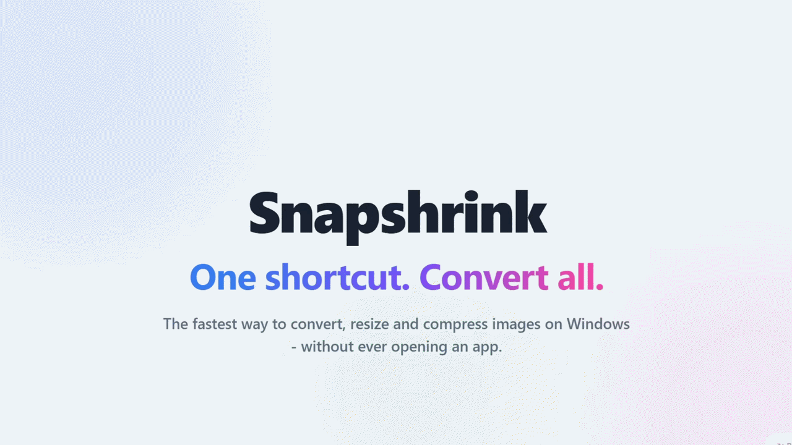
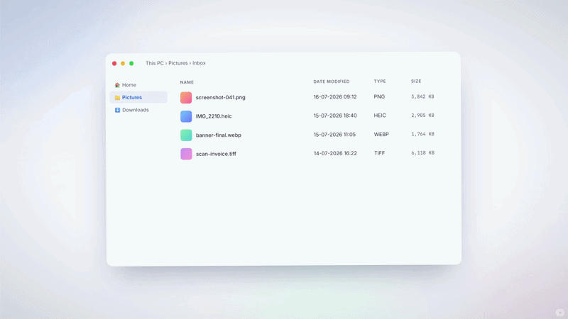
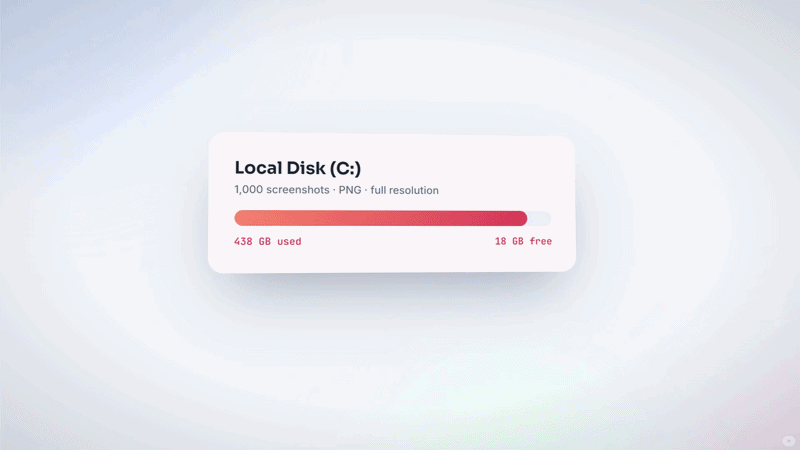
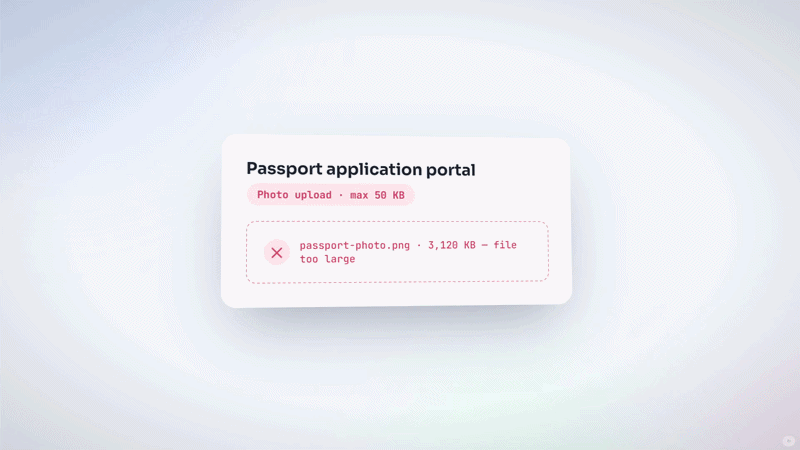
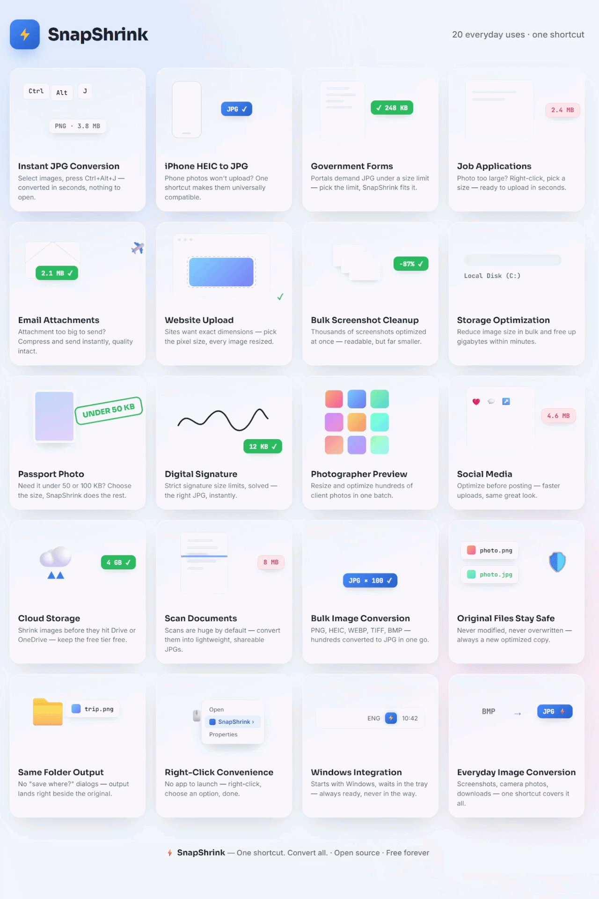

<div align="center">
  
</div>

<br>

<div align="center">

  <a href="https://github.com/thevijayparmar/snapshrink/releases/latest"></a>
  <a href="https://github.com/thevijayparmar/snapshrink/blob/main/LICENSE"></a>
  <a href="https://pypi.org/project/snapshrink/"></a>
  <a href="https://pypi.org/project/snapshrink/"></a>
  
  
  

</div>

<br>

<div align="center">
  <h1>⚡ Snapshrink</h1>
  <p><strong>Right-click. One click. Done.</strong></p>
  <p>The fastest way to convert, resize and compress images on Windows — without ever opening an app.</p>
</div>

<div align="center">
  <a href="https://www.linkedin.com/in/thevijayparmar/">
    
  </a>
  &nbsp;
  <a href="https://github.com/thevijayparmar/snapshrink/issues">
    
  </a>
  &nbsp;
  <a href="https://github.com/thevijayparmar/snapshrink/issues">
    
  </a>
</div>

---

## 🎬 Full App Demo
<div align="center">
  
</div>

---

## ⌨️ Instant Hotkey — Ctrl+Alt+J

Select images in Explorer. Press `Ctrl+Alt+J`. Done. No window ever opens.

<div align="center">
  
</div>

---

## 📐 Resize by Pixel Limit

<div align="center">
  
</div>

<div align="center">
  <a href="https://www.youtube.com/watch?v=UkVQmXykHNQ">
    
  </a>
  <br/>
  <em>>▶ Watch on YouTube</em>
</div>

---

## 💾 Compress by Storage Limit

Tell Snapshrink the max file size you want. It finds the right quality automatically — no trial and error.

<div align="center">
  
</div>

<div align="center">
  <a href="https://www.youtube.com/watch?v=9U3icOsj5Y8">
    
  </a>
  <br/>
  <em>>▶ Watch on YouTube</em>
</div>

---
## 💾 Compress from Tool

For More controls you can use tool itself. 
<div align="center">
  <a href="https://www.youtube.com/watch?v=jOLwTWXBWuk">
    
  </a>
  <br/>
  <em>>▶ Watch on YouTube</em>
</div>

---

## 🚀 10,000+ PNG Images Converted in 8 Minutes — 90% Storage Saved

<div align="center">
  <a href="https://www.youtube.com/watch?v=AF72Nfw5J98">
    
  </a>
  <br/>
  <em>▶ Batch conversion stress test — 10,000+ PNGs, one shortcut, 8 minutes</em>
</div>

---

## 🎯 Multiple Use Cases

<div align="center">
  
</div>

---

## Why Snapshrink exists

Screenshots save as PNG. Photos from your phone arrive as HEIC. Downloads show up as WebP or BMP — anything except the one format every website upload form actually wants: **JPG**.

The usual fixes are all broken in their own way:
- Photo editors **overwrite your original** file
- Online converters **upload your images** to someone's server
- None of them let you say *"just keep it under 250 KB"* and have it actually work

Snapshrink solves all three, right from the Windows right-click menu.

---

## What it does

| Feature | Detail |
|---|---|
| **Convert** | JPG, PNG, WebP output — one click from Explorer |
| **Resize** | 7 pixel presets: 480p → 2500px, or custom |
| **Compress** | 6 size targets: 50 KB → 2 MB, engine finds quality automatically |
| **Hotkey** | `Ctrl+Alt+J` — no window, instant conversion |
| **Originals safe** | Every run creates a new file, source is never touched |
| **Offline** | No internet, no uploads, no accounts |

---

## Supported Formats

| Direction | Formats |
|---|---|
| **Input** | JPEG, PNG, WebP, GIF, TIFF, BMP, ICO, HEIC/HEIF |
| **Output** | JPG, PNG, WebP |

---

## 🖥️ Install (Windows App)

1. Download the latest `SnapshrinkSetup.exe` from [**Releases →**](../../releases)
2. Run it — no admin rights needed, installs to your user folder
3. Right-click any image → **Snapshrink** → pick an option

> **SmartScreen warning?** Click **More info → Run anyway**. This is expected for independently-published tools. See [SECURITY.md](SECURITY.md) for why this happens and how to verify the app yourself.

---

## 🐍 Python Library (pip install)

Snapshrink's conversion engine is also available as a pip-installable Python library — useful for scripts, automation, and batch workflows.

```bash
pip install snapshrink
```

### Quick start

```python
from sspack.engine import process_batch, Options

# Convert a single image to JPG
process_batch(
    inputs=["photo.png"],
    opts=Options(format="jpg", quality=85)
)

# Compress to target file size (under 250 KB)
process_batch(
    inputs=["photo.png"],
    opts=Options(format="jpg", max_kb=250)
)

# Resize to max dimension (1080p)
process_batch(
    inputs=["photo.heic"],
    opts=Options(format="jpg", max_px=1920)
)

# Batch convert a whole folder
import glob
process_batch(
    inputs=glob.glob("photos/*.heic"),
    opts=Options(format="jpg", quality=90)
)
```

### Options reference

```python
Options(
    format="jpg",        # Output format: "jpg", "png", "webp"
    quality=85,          # JPEG/WebP quality (1–95)
    max_kb=None,         # Target max file size in KB (auto-finds quality)
    max_px=None,         # Resize to max dimension in pixels (keeps aspect ratio)
    strip_exif=False,    # Strip EXIF/GPS metadata
)
```

> **Requires:** Python 3.10+, Windows (for GUI/daemon features). The core `process_batch` engine runs on any OS.

---

## 🔧 Building from Source

```bash
# Clone the repo
git clone https://github.com/thevijayparmar/snapshrink.git
cd snapshrink

# Install dependencies
pip install -r requirements.txt

# Run self-tests (29 tests, no Windows needed)
python -m sspack.engine --selftest

# Build the Windows app
python installer/build_app.py
# Then open installer/Snapshrink.iss in Inno Setup and press F9
```

See [`installer/`](installer) for the full build pipeline details.

---

## 🤝 Contributing

Contributions are welcome! See [CONTRIBUTING.md](CONTRIBUTING.md) for how to get started. Check [Issues](../../issues) for open ideas and bugs.

---

## 📜 License

MIT — see [LICENSE](LICENSE). Free for personal and commercial use.

---

<div align="center">
  <strong>Open Source · Free Forever</strong>
  <br/>
  Developed by <a href="https://www.linkedin.com/in/thevijayparmar/">Vijay Parmar</a>
  <br/><br/>
  <a href="https://www.linkedin.com/in/thevijayparmar/">
    
  </a>
  &nbsp;
  <a href="https://github.com/thevijayparmar/snapshrink/issues">
    
  </a>
</div>
